# Movies

**Movies** is a Xamarin.Forms **GTK backend** application that makes use of The Movie Database (TMDb) API, a popular, user editable database for movies and TV shows, to demonstrate the possibilities of the new backend making use of a great variety of functionality.

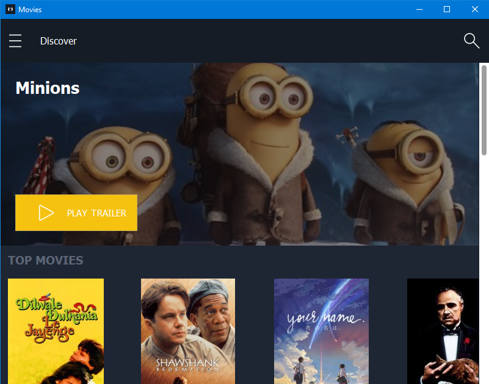

## Xamarin.Forms App 

[Xamarin.Forms](https://www.xamarin.com/forms) allows you to build native UIs for iOS, Android, Windows, macOS and **Linux** from a single, shared codebase. You can dive into mobile development with Xamarin.Forms by following our [free self-guided learning](https://university.xamarin.com/classes/track/self-guided) from Xamarin University. This project exercises the following patterns and features:

* Xamarin.Forms
  * [XAML UI](https://developer.xamarin.com/guides/xamarin-forms/xaml/xaml-basics/)
  * Behaviors
  * Converters
  * Custom Controls
  * [Custom Renderers](https://developer.xamarin.com/guides/xamarin-forms/custom-renderer/)
  * [Data Binding](https://developer.xamarin.com/guides/xamarin-forms/xaml/xaml-basics/data_binding_basics/)
  * IoC
  * [Messaging Center](https://developer.xamarin.com/guides/xamarin-forms/messaging-center/)
  * [MVVM](https://developer.xamarin.com/guides/xamarin-forms/xaml/xaml-basics/data_bindings_to_mvvm/)
  * [Styles](https://developer.xamarin.com/guides/xamarin-forms/user-interface/styles/)
  * Triggers
  * Gtk Themes
  

## Screens

 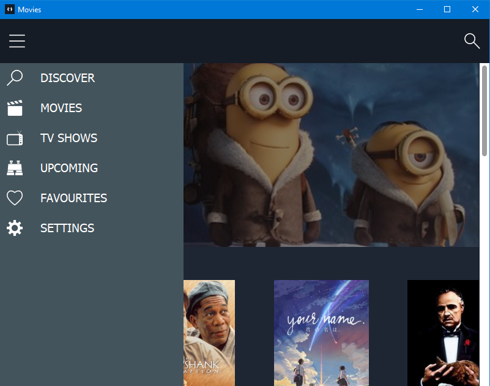 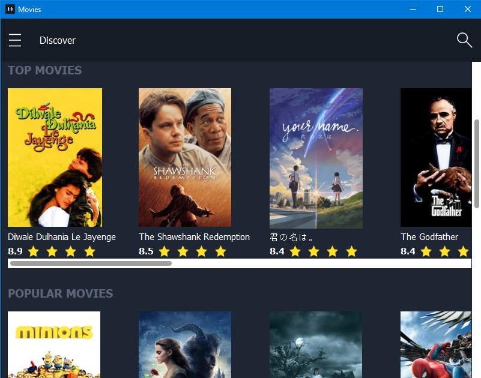 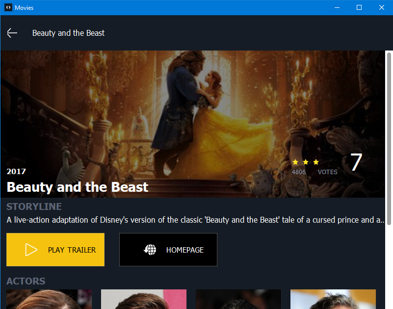 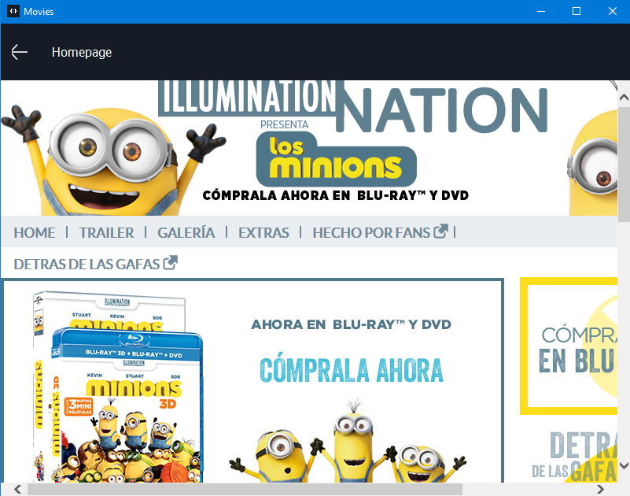 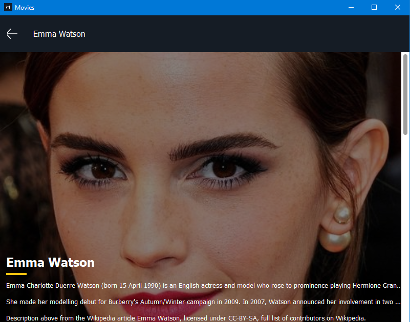 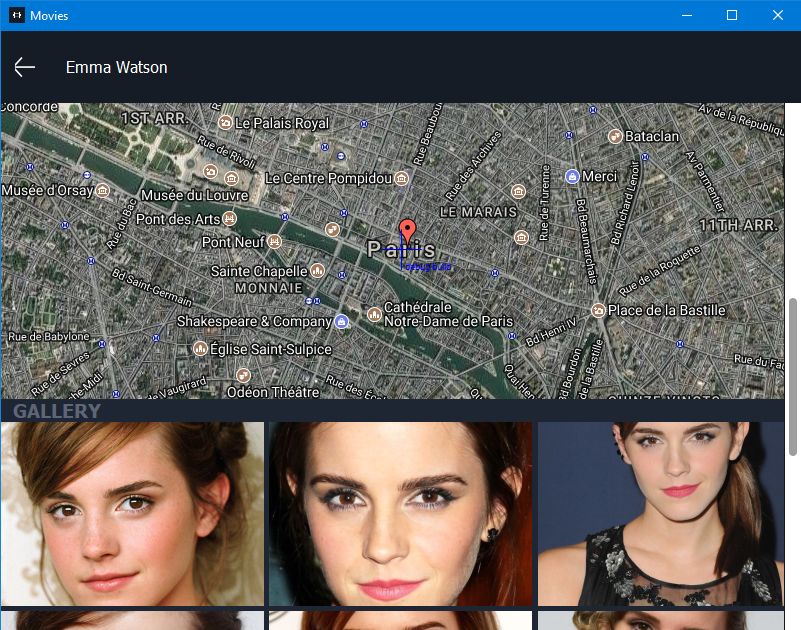 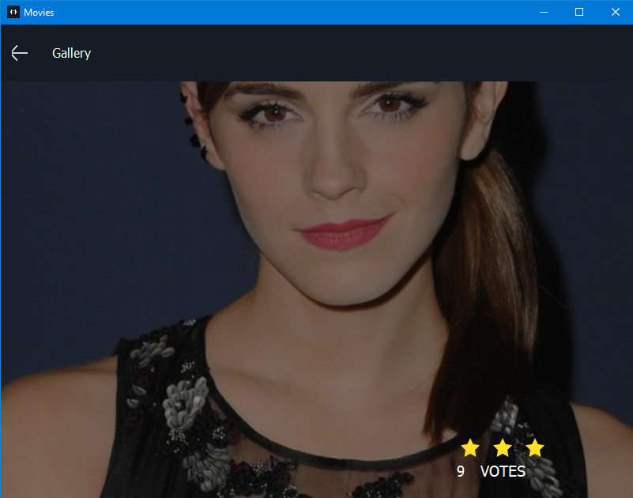 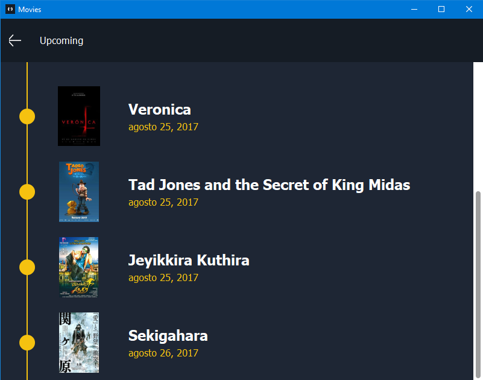 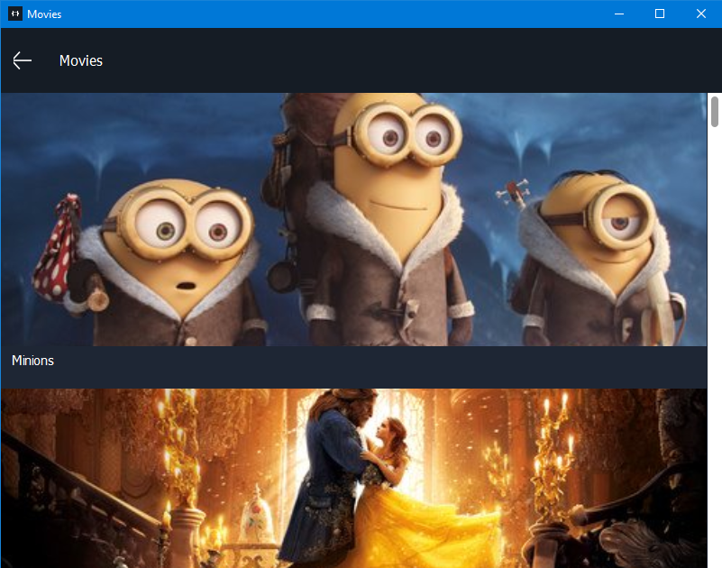 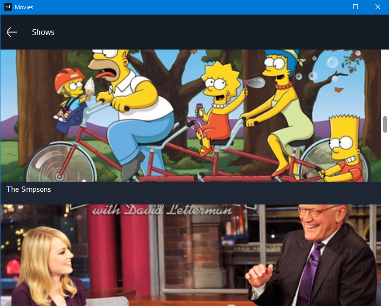

## Requirements

* [Visual Studio __2015__](https://www.visualstudio.com/en-us/products/vs-2015-product-editions.aspx) Update 3 (14.0 or higher) to compile C# 6 language features (or Visual Studio MacOS)
* Xamarin add-ons for Visual Studio 3.2.1.64 or higher (available via the Visual Studio installer)
* __Visual Studio Community Edition is fully supported!__

## Setup

**Download** or clone the repository. This is a solution with two projects.

**Rebuild** the solution to get all neccesary **NuGet** packages.

Access to **AppSettings.cs** file available in the Portable Class Library to introduce your TMDb APIs key.

Enjoy!

## Clean and Rebuild

If you see build issues when pulling updates from the repo, try cleaning and rebuilding the solution.

## Copyright and license

Code released under the [MIT license](https://opensource.org/licenses/MIT).
